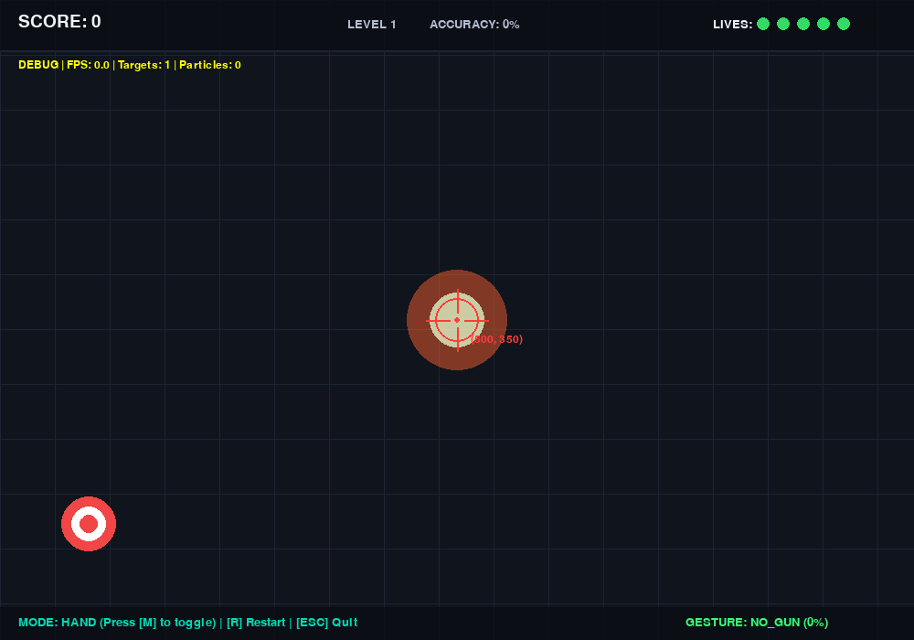

# 🎯 Hand Gun Gesture Shooter

An interactive, real-time computer-vision shooting gallery game built with **Python**, **OpenCV**, **MediaPipe**, **Scikit-learn**, and **Pygame**. 

Point your index finger like a gun to aim your virtual crosshair, and pull down your thumb like a trigger to fire shots at moving targets.



---

## 🌟 Features

- **Real-Time Hand Tracking**: Extracts 21 3D hand landmarks using MediaPipe Hands at high frame rates.
- **Machine Learning Gesture Recognition**: A Random Forest classifier trained on 63 normalized landmark features distinguishes between:
  - `NO_GUN`: Neutral, open hand, fist, or other non-gun configurations.
  - `GUN_READY`: Index finger extended and thumb up (activates the aiming crosshair).
  - `SHOOT`: Thumb pulled/curled down in a deliberate trigger action.
- **Exponential Moving Average (EMA) Aim Smoothing**: Removes webcam landmark jitter for smooth, precise crosshair control.
- **Debounced Trigger System**: Cooldown threshold (250ms) prevents machine-gun spamming and guarantees crisp single-shot feel.
- **Interactive 2D Shooting Game**:
  - Moving targets (Normal, Fast, and Bonus Bullseyes) with sinusoidal wobble and dynamic speeds.
  - Combo system, floating score popups, particle explosion bursts, and procedural audio effects.
  - Increasing difficulty as your score and survival time climb.
  - Picture-in-Picture (PiP) mini-webcam HUD feed.
- **Dual Control Modes**:
  - `HAND MODE`: Live webcam computer-vision gesture control.
  - `MOUSE MODE`: Standard mouse aiming and left-click shooting (press `M` to toggle anytime).

---

## 🏗️ Architecture & Pipeline

```text
       Webcam Stream (640x480)
                 ↓
      cv2.flip (Selfie Mirroring)
                 ↓
     MediaPipe Hand Landmark Detection
                 ↓
        21 3D Joint Coordinates
                 ↓
┌──────────────────────────────────────────────┐
│  Normalization (Translation & Scale Invariance)│
│  1. Center wrist (landmark 0) at origin      │
│  2. Scale by middle MCP (landmark 9) dist    │
│  3. Flatten to 63 numerical features         │
└──────────────────────┬───────────────────────┘
                       ↓
         Random Forest Classifier (300 Trees)
                       ↓
        [ NO_GUN / GUN_READY / SHOOT ]
                       ↓
┌──────────────────────────────────────────────┐
│             Gun Controller Layer             │
│  - Index Fingertip (Landmark 8) → Aim coords │
│  - Exponential Moving Average (EMA) smoothing│
│  - Trigger debouncing (250ms cooldown)       │
└──────────────────────┬───────────────────────┘
                       ↓
           Pygame 2D Arcade Engine
        (Target physics, combos, HUD)
```

---

## 📁 Project Structure

```text
hand_gun_game/
│
├── README.md               # Complete documentation and setup guide
├── requirements.txt         # Project dependencies
├── hand_tracker.py         # MediaPipe wrapper & landmark normalization
├── gesture_model.py        # ML inference wrapper and confidence gate
├── controller.py           # Aim smoothing & trigger cooldown debouncing
├── game.py                 # Self-contained Pygame shooting gallery
├── collect_data.py         # Live webcam dataset collection tool
├── train_model.py          # Random Forest training & evaluation script
├── test_gesture.py         # Real-time gesture testing HUD
├── main.py                 # Main integrated application runner
├── generate_starter_data.py# Baseline dataset generator
│
├── models/
│   └── gun_gesture_model.pkl # Trained Random Forest model
│
├── data/
│   └── dataset.csv         # Normalized landmark feature dataset
│
└── screenshots/
    └── gameplay_preview.png# Game preview screenshot
```

---

## 🚀 Installation & Setup

### Requirements
- **Python**: 3.11 or 3.12 (Recommended: Python 3.12)
- **Webcam**: Built-in or external USB camera

### 1. Clone or Navigate to the Project

```bash
cd hand_gun_game
```

### 2. Set Up Virtual Environment

#### macOS / Linux:
```bash
python3 -m venv venv
source venv/bin/activate
pip install -r requirements.txt
```

#### Windows:
```cmd
python -m venv venv
venv\Scripts\activate
pip install -r requirements.txt
```

---

## 🎮 How to Run

A pre-trained model (`models/gun_gesture_model.pkl`) and a baseline dataset (`data/dataset.csv`) are already included. You can jump directly to **Step 4** to play immediately, or follow the complete workflow from scratch:

### Step 1: Collect Custom Hand Data (Optional)
Record your own hand gestures via webcam:
```bash
python collect_data.py
```
- Press `0` to select `NO_GUN` (open hand, fist, neutral).
- Press `1` to select `GUN_READY` (index extended, thumb pointing up).
- Press `2` to select `SHOOT` (gun shape with thumb pulled down).
- Press `SPACE` to toggle continuous frame recording.
- Press `Q` to save to `data/dataset.csv` and quit.

### Step 2: Train the ML Model
Train the Random Forest classifier:
```bash
python train_model.py
```
- Evaluates train/test accuracy with stratified splitting.
- Prints classification report and confusion matrix.
- Saves model to `models/gun_gesture_model.pkl`.

### Step 3: Test Gesture Recognition Live
Verify live detection before launching the game:
```bash
python test_gesture.py
```
- Tests your hand pose in real-time with visual confidence bars and landmark skeletons.
- Press `Q` to exit.

### Step 4: Launch the Game!
Start the integrated gesture shooting game:
```bash
python main.py
```

To run in standalone mouse mode (no webcam needed):
```bash
python main.py --mouse
```

---

## 🕹️ In-Game Controls

| Key / Action | Function |
|---|---|
| **Point Index Finger** | Move virtual crosshair (in `HAND MODE`) |
| **Pull Down Thumb** | Fire shot (Trigger in `HAND MODE`) |
| **Mouse Move + Left Click** | Aim & shoot (in `MOUSE MODE`) |
| **`M`** | Toggle between `HAND MODE` and `MOUSE MODE` |
| **`D`** | Toggle Debug Overlay (FPS, entity counts, reticle coords) |
| **`R`** | Restart round / play again |
| **`Q` / `ESC`** | Quit application |

---

## 📐 The Machine Learning Pipeline

### 1. 21 3D Landmarks
MediaPipe extracts 21 keypoints per hand:
- Landmark 0: Wrist
- Landmarks 1–4: Thumb
- Landmarks 5–8: Index Finger (Landmark 8 = Tip)
- Landmarks 9–12: Middle Finger
- Landmarks 13–16: Ring Finger
- Landmarks 17–20: Pinky Finger

### 2. Biomechanical Landmark Normalization
To ensure invariant classification regardless of where the hand is in the frame or its distance from the camera:
1. **Translation Invariance**: The wrist (landmark 0) is subtracted from every landmark:
   $$\vec{P}'_i = \vec{P}_i - \vec{P}_0$$
2. **Scale Invariance**: The distance from the wrist (landmark 0) to the middle finger MCP joint (landmark 9) is computed as the anatomical palm reference length $d$:
   $$d = \|\vec{P}'_9\|$$
   All 21 coordinates are divided by $d$:
   $$\vec{P}''_{i} = \frac{\vec{P}'_i}{d}$$
3. **Feature Vector**: The 21 normalized 3D coordinates are flattened into 63 numerical features ($x_0, y_0, z_0, \dots, x_{20}, y_{20}, z_{20}$).

### 3. Classification
A 300-estimator `RandomForestClassifier` classifies the hand state with class-weight balancing and a confidence gating threshold ($\ge 0.65$).

### 4. Aim Smoothing
Aiming uses Landmark 8 (Index Fingertip) directly. Raw fingertip coordinates are smoothed using an Exponential Moving Average (EMA):
$$\text{Aim}_t = \alpha \cdot \text{Target}_t + (1 - \alpha) \cdot \text{Aim}_{t-1}$$
where $\alpha = 0.35$. Active margin clamping allows comfortable corner-to-corner screen reach.

---

## 🔧 Troubleshooting

- **Webcam not detected / black screen:**
  - Verify your webcam permissions in OS settings (e.g. macOS System Settings → Privacy & Security → Camera).
  - Use `--camera 1` (or another index) if you have multiple cameras: `python main.py --camera 1`.
  - The game automatically falls back to `MOUSE MODE` if the camera cannot be opened.
- **Model file missing:**
  - Run `python train_model.py` to compile `models/gun_gesture_model.pkl` from `data/dataset.csv`.
- **Crosshair moves too slowly or feels jittery:**
  - Adjust the smoothing factor via CLI: `python main.py --smoothing 0.5` (higher values = more responsive, lower = smoother).
- **Trigger sensitivity:**
  - Adjust the confidence threshold: `python main.py --threshold 0.60`.

---

## 🔮 Future Improvements

1. **Two-Hand Support**: Dual-wielding hand guns with independent crosshairs.
2. **Reload Gesture**: Pointing hand down or tapping palm with other hand to reload ammo.
3. **Sound Effects Customization**: Add customizable sound packs (laser, revolver, silencer).
4. **Boss Battles**: Multi-hit shielded enemies and power-ups (freeze time, rapid fire).
