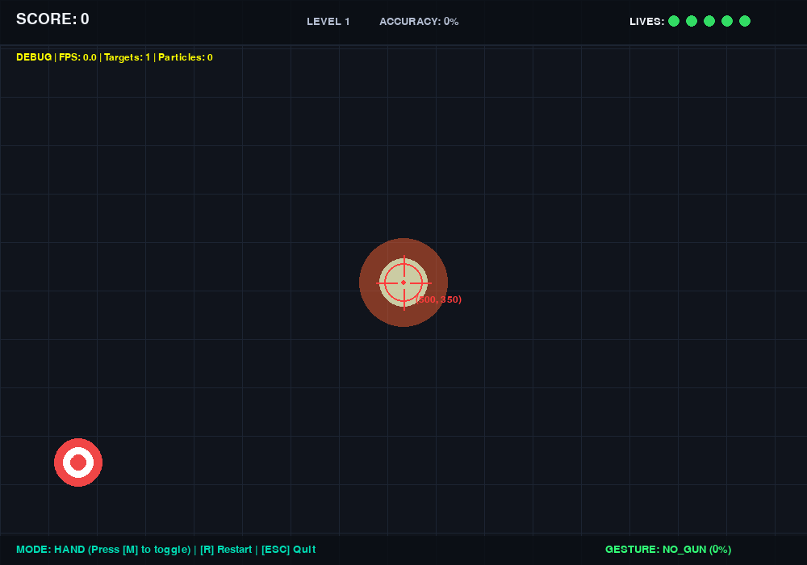

# 🎯 Hand Gun Gesture Shooter

An interactive, real-time computer-vision shooting gallery game available both as a **Desktop Python Application** (OpenCV + MediaPipe + Pygame) and as a **Browser Web Application** (HTML5 Canvas + MediaPipe Web SDK) ready for one-click deployment on **Vercel**.

Point your index finger like a gun to aim your virtual crosshair, and pull down your thumb like a trigger to fire shots at moving targets!



---

## 🌟 Key Features

- **Real-Time Hand Tracking**: Extracts 21 3D hand landmarks using MediaPipe Hands at high frame rates.
- **Hybrid Gesture Recognition Engine**:
  - **Machine Learning**: A 300-tree Random Forest classifier trained on 6,000 samples across both left and right hands.
  - **Biomechanical Rules**: Real-time geometric validation (index finger extension, middle/ring/pinky curling, and thumb trigger pull metric).
  - Recognizes `NO_GUN`, `GUN_READY`, and `SHOOT` with rock-solid stability from any angle or distance.
- **Dynamic Dual-Path Trigger**:
  - Fires via ML gesture detection OR instantaneous physical thumb pull-down metric ($\text{ratio} < 0.52$).
  - Configurable debouncing cooldown (250 ms) ensures crisp, single-shot firing without accidental bursts.
- **Exponential Moving Average (EMA) Smoothing**: Eliminates webcam landmark jitter for fluid, pinpoint crosshair targeting.
- **Polished 2D Arcade Game**:
  - 3 target tiers (Normal, Fast, and Bonus Bullseyes) with sinusoidal physics and dynamic speeds.
  - Combo system, floating score popups, particle explosion bursts, and procedural audio effects (zero external audio file dependencies).
  - Picture-in-Picture (PiP) mini-webcam HUD feed.
- **Dual Control Modes**:
  - `HAND MODE`: Live webcam computer-vision gesture control.
  - `MOUSE MODE`: Standard mouse aiming and left-click shooting (press `M` to toggle anytime).
- **Two Ways to Play**:
  - **Desktop (Python)**: Pygame + OpenCV + Scikit-learn.
  - **Web (Vercel / Browser)**: HTML5 Canvas + Web Audio API + MediaPipe Web SDK.

---

## 🏗️ Architecture & Pipeline

```text
       Webcam Stream (640x480)
                 ↓
      cv2.flip (Selfie Mirroring)
                 ↓
     MediaPipe Hand Landmark Detection
                 ↓
        21 3D Joint Coordinates
                 ↓
┌──────────────────────────────────────────────┐
│  Normalization (Translation & Scale Invariance)│
│  1. Center wrist (landmark 0) at origin      │
│  2. Scale by middle MCP (landmark 9) dist    │
│  3. Flatten to 63 numerical features         │
└──────────────────────┬───────────────────────┘
                       ↓
┌──────────────────────────────────────────────┐
│         Hybrid Gesture Classification        │
│  - Random Forest Classifier (6,000 samples)  │
│  - Biomechanical Finger State Validation     │
│  - Left-hand & Right-hand support            │
└──────────────────────┬───────────────────────┘
                       ↓
        [ NO_GUN / GUN_READY / SHOOT ]
                       ↓
┌──────────────────────────────────────────────┐
│             Gun Controller Layer             │
│  - Index Fingertip (Landmark 8) → Aim coords │
│  - Exponential Moving Average (EMA) smoothing│
│  - Trigger debouncing (250ms cooldown)       │
│  - Instant thumb pull-down detection         │
└──────────────────────┬───────────────────────┘
                       ↓
           Pygame / Web Canvas Engine
        (Target physics, combos, HUD)
```

---

## 📁 Project Structure

```text
hand_gun_game/
│
├── README.md               # Complete documentation and setup guide
├── requirements.txt         # Python project dependencies
├── .gitignore              # Ignores venv, caches, and OS files
├── vercel.json             # Vercel static deployment configuration
│
├── index.html              # Web Edition entrypoint (Vercel-ready)
├── web_game.js             # Browser game engine & MediaPipe Web tracker
│
├── hand_tracker.py         # MediaPipe wrapper, normalization & heuristic validation
├── gesture_model.py        # Hybrid ML classifier wrapper with confidence fusion
├── controller.py           # Aim smoothing & dual-path trigger debouncing
├── game.py                 # Self-contained Pygame shooting gallery
├── collect_data.py         # Live webcam dataset collection tool
├── train_model.py          # Random Forest training & evaluation script
├── test_gesture.py         # Real-time gesture testing HUD with trigger feedback
├── main.py                 # Main integrated Python desktop application
├── generate_starter_data.py# 6,000-sample left/right hand dataset generator
│
├── models/
│   └── gun_gesture_model.pkl # Trained Random Forest model (99.8% test accuracy)
│
├── data/
│   └── dataset.csv         # 6,000 normalized landmark samples
│
└── screenshots/
    └── gameplay_preview.png# Game preview screenshot
```

---

## 🌐 Deploy to Vercel (Web Version)

The project includes a standalone **Web Edition** that runs MediaPipe directly inside any modern web browser without needing Python installed on the client.

### Steps to Deploy:
1. Push this repository to your GitHub account (e.g. `https://github.com/Siddhartha39/hand-shoot-game`).
2. Log in to [vercel.com](https://vercel.com) and click **"Add New Project"**.
3. Import your **`hand-shoot-game`** repository.
4. Set **Framework Preset** to **Other** (configured via [`vercel.json`](file:///Users/siddhartha/Desktop/aad/projects/hand_gun_game/vercel.json)).
5. Click **"Deploy"**.

### Test Web Edition Locally:
```bash
python3 -m http.server 8000
```
Open [http://localhost:8000](http://localhost:8000) in Chrome, Edge, or Safari, click **"Enable Webcam & Play"**, and enjoy!

---

## 💻 Python Desktop Installation & Setup

### Requirements
- **Python**: 3.11 or 3.12 (Recommended: Python 3.12)
- **Webcam**: Built-in or external USB camera

### 1. Set Up Virtual Environment

#### macOS / Linux:
```bash
python3 -m venv venv
source venv/bin/activate
pip install -r requirements.txt
```

#### Windows:
```cmd
python -m venv venv
venv\Scripts\activate
pip install -r requirements.txt
```

---

## 🎮 How to Run (Desktop Python)

A pre-trained model ([`models/gun_gesture_model.pkl`](file:///Users/siddhartha/Desktop/aad/projects/hand_gun_game/models/gun_gesture_model.pkl)) and a 6,000-sample dataset ([`data/dataset.csv`](file:///Users/siddhartha/Desktop/aad/projects/hand_gun_game/data/dataset.csv)) are already bundled. You can jump directly to **Step 4** to play immediately, or follow the complete workflow:

### Step 1: Collect Custom Hand Data (Optional)
Record your own hand gestures via webcam:
```bash
python collect_data.py
```
- Press `0` to select `NO_GUN` (open hand, fist, neutral).
- Press `1` to select `GUN_READY` (index extended, thumb pointing up).
- Press `2` to select `SHOOT` (gun shape with thumb pulled down).
- Press `SPACE` to toggle continuous frame recording.
- Press `Q` to save to [`data/dataset.csv`](file:///Users/siddhartha/Desktop/aad/projects/hand_gun_game/data/dataset.csv) and quit.

### Step 2: Train the ML Model
Train the Random Forest classifier:
```bash
python train_model.py
```
- Evaluates train/test accuracy with stratified splitting.
- Outputs precision, recall, and confusion matrix.
- Saves model to [`models/gun_gesture_model.pkl`](file:///Users/siddhartha/Desktop/aad/projects/hand_gun_game/models/gun_gesture_model.pkl).

### Step 3: Test Gesture Recognition Live
Verify live detection and trigger sensitivity before launching the game:
```bash
python test_gesture.py
```
- Tests your hand pose in real-time with visual confidence bars and landmark skeletons.
- Displays **`TRIGGER: READY`** when thumb is up and **`TRIGGER: BANG! FIRED!`** when thumb pulls down.
- Press `Q` to exit.

### Step 4: Launch the Game!
Start the integrated gesture shooting game:
```bash
python main.py
```

To run in standalone mouse mode (no webcam needed):
```bash
python main.py --mouse
```

---

## 🕹️ In-Game Controls

| Key / Action | Function |
|---|---|
| **Point Index Finger** | Move virtual crosshair (in `HAND MODE`) |
| **Pull Down Thumb** | Fire shot (Trigger in `HAND MODE`) |
| **Mouse Move + Left Click** | Aim & shoot (in `MOUSE MODE`) |
| **`M`** | Toggle between `HAND MODE` and `MOUSE MODE` |
| **`D`** | Toggle Debug Overlay (FPS, entity counts, reticle coords) |
| **`R`** | Restart round / play again |
| **`Q` / `ESC`** | Quit application |

---

## 📐 The Machine Learning & Geometry Pipeline

### 1. 21 3D Landmarks
MediaPipe extracts 21 keypoints per hand:
- Landmark 0: Wrist
- Landmarks 1–4: Thumb (Landmark 4 = Tip)
- Landmarks 5–8: Index Finger (Landmark 8 = Tip)
- Landmarks 9–12: Middle Finger
- Landmarks 13–16: Ring Finger
- Landmarks 17–20: Pinky Finger

### 2. Biomechanical Landmark Normalization
To ensure invariant classification regardless of where the hand is in the frame or its distance from the camera:
1. **Translation Invariance**: The wrist (landmark 0) is subtracted from every landmark:
   $$\vec{P}'_i = \vec{P}_i - \vec{P}_0$$
2. **Scale Invariance**: The distance from the wrist (landmark 0) to the middle finger MCP joint (landmark 9) is computed as the anatomical palm reference length $d$:
   $$d = \|\vec{P}'_9\|$$
   All 21 coordinates are divided by $d$:
   $$\vec{P}''_{i} = \frac{\vec{P}'_i}{d}$$
3. **Feature Vector**: The 21 normalized 3D coordinates are flattened into 63 numerical features ($x_0, y_0, z_0, \dots, x_{20}, y_{20}, z_{20}$).

### 3. Hybrid Classification & Trigger Logic
1. **Machine Learning Model**: A 300-tree `RandomForestClassifier` with balanced class weights trained on 6,000 rotation-augmented left- and right-hand samples.
2. **Biomechanical Geometry Validation**:
   - **Index Extended**: $\text{dist}(\text{wrist}, \text{index\_tip}) > 1.08 \times \text{dist}(\text{wrist}, \text{index\_pip})$.
   - **Other Fingers Folded**: At least 2 of 3 fingers (middle, ring, pinky) have their tips curled towards the palm.
   - **Trigger Pull Metric**: Ratio of Euclidean distance between thumb tip and index base relative to palm size:
     $$\text{Metric} = \frac{\|\text{thumb\_tip} - \text{index\_mcp}\|}{\|\text{middle\_mcp} - \text{wrist}\|}$$
     - $\text{Metric} \ge 0.52$: Cocked / Hammer Up $\rightarrow$ `GUN_READY`
     - $\text{Metric} < 0.52$: Pulled / Hammer Down $\rightarrow$ `SHOOT` (fires trigger with 250ms cooldown)

### 4. Aim Smoothing
Aiming uses Landmark 8 (Index Fingertip) directly. Raw fingertip coordinates are smoothed using an Exponential Moving Average (EMA):
$$\text{Aim}_t = \alpha \cdot \text{Target}_t + (1 - \alpha) \cdot \text{Aim}_{t-1}$$
where $\alpha = 0.35$. Active margin clamping allows comfortable corner-to-corner screen reach.

---

## 🔧 Troubleshooting

- **Webcam not detected / black screen:**
  - Verify your webcam permissions in OS settings (e.g. macOS System Settings → Privacy & Security → Camera).
  - Use `--camera 1` (or another index) if you have multiple cameras: `python main.py --camera 1`.
  - The game automatically falls back to `MOUSE MODE` if the camera cannot be opened.
- **Vercel deployment says "No python entrypoint found":**
  - In your Vercel Project Settings under **General** $\rightarrow$ **Framework Preset**, select **"Other"**.
  - The repository includes [`vercel.json`](file:///Users/siddhartha/Desktop/aad/projects/hand_gun_game/vercel.json) configured with `@vercel/static` so Vercel deploys the web edition directly.
- **Crosshair moves too slowly or feels jittery:**
  - Adjust the smoothing factor via CLI: `python main.py --smoothing 0.5` (higher values = more responsive, lower = smoother).
- **Trigger sensitivity:**
  - Adjust the confidence threshold: `python main.py --threshold 0.60`.

---

## 🔮 Future Improvements

1. **Two-Hand Support**: Dual-wielding hand guns with independent crosshairs.
2. **Reload Gesture**: Pointing hand down or tapping palm with other hand to reload ammo.
3. **Sound Effects Customization**: Add customizable sound packs (laser, revolver, silencer).
4. **Boss Battles**: Multi-hit shielded enemies and power-ups (freeze time, rapid fire).
